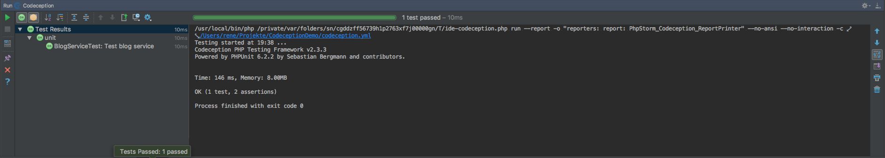

Codeception Demo
====

A Symfony project to show the power of Codeception.


prepare your System
=======
Download and install 
* [Docker](https://www.docker.com/docker-mac)   
* [Docker Compose](https://docs.docker.com/compose/install/)   
* [Docker Symc](https://github.com/EugenMayer/docker-sync) (Mac and Windows only)  
* [Composer](https://getcomposer.org/download/)  
* [Symfony Tool](http://symfony.com/doc/current/setup.html)  

from scrach
===========
Run the following Commands to init your own App

* ```symfony new blog latest```
```

 ✔  Symfony 3.3.2 was successfully installed. Now you can:

    * Change your current directory to /Users/rene/Projekte/CodeceptionDemo/blog

    * Configure your application in app/config/parameters.yml file.

    * Run your application:
        1. Execute the php bin/console server:start command.
        2. Browse to the http://localhost:8000 URL.

    * Read the documentation at http://symfony.com/doc
```
* ```cd blog```
* ```composer.phar require "codeception/codeception:*"```
```./composer.json has been updated
   Loading composer repositories with package information
   Updating dependencies (including require-dev)
   Package operations: 35 installs, 0 updates, 0 removals
     - Installing stecman/symfony-console-completion (0.7.0) Downloading: 100%         
     - Installing sebastian/diff (1.4.3) Downloading: 100%         
     - Installing sebastian/recursion-context (3.0.0) Downloading: 100%         
     - Installing sebastian/exporter (3.1.0) Downloading: 100%         
     - Installing sebastian/comparator (2.0.0) Downloading: 100%         
     - Installing phpunit/php-text-template (1.2.1) Loading from cache
     - Installing phpunit/phpunit-mock-objects (4.0.1) Downloading: 100%         
     - Installing sebastian/version (2.0.1) Loading from cache
     - Installing sebastian/resource-operations (1.0.0) Loading from cache
     - Installing sebastian/object-reflector (1.1.1) Downloading: 100%         
     - Installing sebastian/object-enumerator (3.0.2) Downloading: 100%         
     - Installing sebastian/global-state (2.0.0) Downloading: 100%         
     - Installing sebastian/environment (3.0.4) Downloading: 100%         
     - Installing phpunit/php-timer (1.0.9) Downloading: 100%         
     - Installing phpunit/php-file-iterator (1.4.2) Loading from cache
     - Installing theseer/tokenizer (1.1.0) Downloading: 100%         
     - Installing sebastian/code-unit-reverse-lookup (1.0.1) Downloading: 100%         
     - Installing phpunit/php-token-stream (1.4.11) Downloading: 100%         
     - Installing phpunit/php-code-coverage (5.2.1) Downloading: 100%         
     - Installing webmozart/assert (1.2.0) Loading from cache
     - Installing phpdocumentor/reflection-common (1.0) Loading from cache
     - Installing phpdocumentor/type-resolver (0.2.1) Loading from cache
     - Installing phpdocumentor/reflection-docblock (3.1.1) Loading from cache
     - Installing phpspec/prophecy (v1.7.0) Downloading: 100%         
     - Installing phar-io/version (1.0.1) Downloading: 100%         
     - Installing phar-io/manifest (1.0.1) Downloading: 100%         
     - Installing myclabs/deep-copy (1.6.1) Downloading: 100%         
     - Installing phpunit/phpunit (6.2.2) Downloading: 100%         
     - Installing psr/http-message (1.0.1) Loading from cache
     - Installing guzzlehttp/psr7 (1.4.2) Downloading: 100%         
     - Installing guzzlehttp/promises (v1.3.1) Loading from cache
     - Installing guzzlehttp/guzzle (6.3.0) Downloading: 100%         
     - Installing facebook/webdriver (1.4.1) Downloading: 100%         
     - Installing behat/gherkin (v4.4.5) Downloading: 100%         
     - Installing codeception/codeception (2.3.3) Downloading: 100%         
   sebastian/global-state suggests installing ext-uopz (*)
   phpunit/php-code-coverage suggests installing ext-xdebug (^2.5.3)
   phpunit/phpunit suggests installing phpunit/php-invoker (^1.1)
   phpunit/phpunit suggests installing ext-xdebug (*)
   codeception/codeception suggests installing codeception/specify (BDD-style code blocks)
   codeception/codeception suggests installing codeception/verify (BDD-style assertions)
   codeception/codeception suggests installing flow/jsonpath (For using JSONPath in REST module)
   codeception/codeception suggests installing phpseclib/phpseclib (for SFTP option in FTP Module)
   codeception/codeception suggests installing league/factory-muffin (For DataFactory module)
   codeception/codeception suggests installing league/factory-muffin-faker (For Faker support in DataFactory module)
   Writing lock file
   Generating autoload files
   > Incenteev\ParameterHandler\ScriptHandler::buildParameters
   Updating the "app/config/parameters.yml" file
   > Sensio\Bundle\DistributionBundle\Composer\ScriptHandler::buildBootstrap
   > Sensio\Bundle\DistributionBundle\Composer\ScriptHandler::clearCache
   
    // Clearing the cache for the dev environment with debug                       
    // true                                                                        
   
                                                                                   
    [OK] Cache for the "dev" environment (debug=true) was successfully cleared.    
                                                                                   
   
   > Sensio\Bundle\DistributionBundle\Composer\ScriptHandler::installAssets
   
    Trying to install assets as relative symbolic links.
   
    -- -------- ---------------- 
        Bundle   Method / Error  
    -- -------- ---------------- 
   
                                                                                   
    [OK] All assets were successfully installed.                                   
                                                                                   
   
   > Sensio\Bundle\DistributionBundle\Composer\ScriptHandler::installRequirementsFile
   > Sensio\Bundle\DistributionBundle\Composer\ScriptHandler::prepareDeploymentTarget
```
* ```docker-sync-stack start```
```
       note:  You can also run docker-sync in the background with docker-sync --daemon
          ok  Starting native_osx for sync symfony-codeception-sync
          ok  symfony-codeception-sync container still running, restarting unison in container
     command  docker exec symfony-codeception-sync supervisorctl restart unison
          ok  starting initial sync of symfony-codeception-sync
     success  Sync container started
     success  Showing unison logs from your sync container: symfony-codeception-sync
          ok  Found implicit docker-compose-dev.yml and using it from /Users/rene/Projekte/CodeceptionDemo/docker-compose-dev.yml
          ok  starting compose
   Sync Log:  UNISON 2.48.4 started propagating changes at 18:52:52.88 on 25 Jun 2017
   Sync Log:  [BGN] Updating file docker-compose-dev.yml from /host_sync to /app_sync
   Sync Log:  [END] Updating file docker-compose-dev.yml
   Sync Log:  UNISON 2.48.4 finished propagating changes at 18:52:52.89 on 25 Jun 2017
   Sync Log:  Synchronization complete at 18:52:52  (1 item transferred, 0 skipped, 0 failed)
Creating network "codeceptiondemo_symfony" with the default driver
Creating codeceptiondemo_symfony_mysql_1
Creating codeceptiondemo_symfony_1
Attaching to codeceptiondemo_symfony_mysql_1, codeceptiondemo_symfony_1
symfony_1        | AH00558: apache2: Could not reliably determine the server's fully qualified domain name, using 172.25.0.3. Set the 'ServerName' directive globally to suppress this message
symfony_mysql_1  | Initializing database
symfony_mysql_1  | 2017-06-25T16:53:41.901940Z 0 [Warning] TIMESTAMP with implicit DEFAULT value is deprecated. Please use --explicit_defaults_for_timestamp server option (see documentation for more details).
symfony_mysql_1  | 2017-06-25T16:53:43.281990Z 0 [Warning] InnoDB: New log files created, LSN=45790
symfony_1        | AH00558: apache2: Could not reliably determine the server's fully qualified domain name, using 172.25.0.3. Set the 'ServerName' directive globally to suppress this message
symfony_1        | [Sun Jun 25 16:53:43.565757 2017] [mpm_prefork:notice] [pid 1] AH00163: Apache/2.4.10 (Debian) PHP/7.1.0 configured -- resuming normal operations
symfony_1        | [Sun Jun 25 16:53:43.566186 2017] [core:notice] [pid 1] AH00094: Command line: 'apache2 -D FOREGROUND'
symfony_mysql_1  | 2017-06-25T16:53:43.623264Z 0 [Warning] InnoDB: Creating foreign key constraint system tables.
symfony_mysql_1  | 2017-06-25T16:53:43.715680Z 0 [Warning] No existing UUID has been found, so we assume that this is the first time that this server has been started. Generating a new UUID: d90038c1-59c6-11e7-aae0-0242ac190002.
symfony_mysql_1  | 2017-06-25T16:53:43.739213Z 0 [Warning] Gtid table is not ready to be used. Table 'mysql.gtid_executed' cannot be opened.
symfony_mysql_1  | 2017-06-25T16:53:43.740831Z 1 [Warning] root@localhost is created with an empty password ! Please consider switching off the --initialize-insecure option.
symfony_mysql_1  | 2017-06-25T16:53:52.681604Z 1 [Warning] 'user' entry 'root@localhost' ignored in --skip-name-resolve mode.
symfony_mysql_1  | 2017-06-25T16:53:52.682180Z 1 [Warning] 'user' entry 'mysql.sys@localhost' ignored in --skip-name-resolve mode.
symfony_mysql_1  | 2017-06-25T16:53:52.682443Z 1 [Warning] 'db' entry 'sys mysql.sys@localhost' ignored in --skip-name-resolve mode.
symfony_mysql_1  | 2017-06-25T16:53:52.682978Z 1 [Warning] 'proxies_priv' entry '@ root@localhost' ignored in --skip-name-resolve mode.
symfony_mysql_1  | 2017-06-25T16:53:52.684267Z 1 [Warning] 'tables_priv' entry 'sys_config mysql.sys@localhost' ignored in --skip-name-resolve mode.
symfony_mysql_1  | Database initialized
symfony_mysql_1  | MySQL init process in progress...
symfony_mysql_1  | 2017-06-25T16:53:57.861756Z 0 [Warning] TIMESTAMP with implicit DEFAULT value is deprecated. Please use --explicit_defaults_for_timestamp server option (see documentation for more details).
symfony_mysql_1  | 2017-06-25T16:53:57.875695Z 0 [Note] mysqld (mysqld 5.7.17) starting as process 55 ...
symfony_mysql_1  | 2017-06-25T16:53:57.891246Z 0 [Note] InnoDB: PUNCH HOLE support available
symfony_mysql_1  | 2017-06-25T16:53:57.891902Z 0 [Note] InnoDB: Mutexes and rw_locks use GCC atomic builtins
symfony_mysql_1  | 2017-06-25T16:53:57.892434Z 0 [Note] InnoDB: Uses event mutexes
symfony_mysql_1  | 2017-06-25T16:53:57.892738Z 0 [Note] InnoDB: GCC builtin __atomic_thread_fence() is used for memory barrier
symfony_mysql_1  | 2017-06-25T16:53:57.893169Z 0 [Note] InnoDB: Compressed tables use zlib 1.2.3
symfony_mysql_1  | 2017-06-25T16:53:57.893503Z 0 [Note] InnoDB: Using Linux native AIO
symfony_mysql_1  | 2017-06-25T16:53:57.898175Z 0 [Note] InnoDB: Number of pools: 1
symfony_mysql_1  | 2017-06-25T16:53:57.900430Z 0 [Note] InnoDB: Using CPU crc32 instructions
symfony_mysql_1  | 2017-06-25T16:53:57.908190Z 0 [Note] InnoDB: Initializing buffer pool, total size = 128M, instances = 1, chunk size = 128M
symfony_mysql_1  | 2017-06-25T16:53:57.953875Z 0 [Note] InnoDB: Completed initialization of buffer pool
symfony_mysql_1  | 2017-06-25T16:53:57.973511Z 0 [Note] InnoDB: If the mysqld execution user is authorized, page cleaner thread priority can be changed. See the man page of setpriority().
symfony_mysql_1  | 2017-06-25T16:53:57.993951Z 0 [Note] InnoDB: Highest supported file format is Barracuda.
symfony_mysql_1  | 2017-06-25T16:53:58.058286Z 0 [Note] InnoDB: Creating shared tablespace for temporary tables
symfony_mysql_1  | 2017-06-25T16:53:58.059072Z 0 [Note] InnoDB: Setting file './ibtmp1' size to 12 MB. Physically writing the file full; Please wait ...
symfony_mysql_1  | 2017-06-25T16:53:58.247358Z 0 [Note] InnoDB: File './ibtmp1' size is now 12 MB.
symfony_mysql_1  | 2017-06-25T16:53:58.254420Z 0 [Note] InnoDB: 96 redo rollback segment(s) found. 96 redo rollback segment(s) are active.
symfony_mysql_1  | 2017-06-25T16:53:58.255112Z 0 [Note] InnoDB: 32 non-redo rollback segment(s) are active.
symfony_mysql_1  | 2017-06-25T16:53:58.257312Z 0 [Note] InnoDB: Waiting for purge to start
symfony_mysql_1  | 2017-06-25T16:53:58.308146Z 0 [Note] InnoDB: 5.7.17 started; log sequence number 2535844
symfony_mysql_1  | 2017-06-25T16:53:58.308717Z 0 [Note] Plugin 'FEDERATED' is disabled.
symfony_mysql_1  | 2017-06-25T16:53:58.319227Z 0 [Note] InnoDB: Loading buffer pool(s) from /var/lib/mysql/ib_buffer_pool
symfony_mysql_1  | 2017-06-25T16:53:58.354914Z 0 [Note] InnoDB: Buffer pool(s) load completed at 170625 16:53:58
symfony_mysql_1  | 2017-06-25T16:53:58.370132Z 0 [Warning] Failed to set up SSL because of the following SSL library error: SSL context is not usable without certificate and private key
symfony_mysql_1  | 2017-06-25T16:53:58.401946Z 0 [Warning] 'user' entry 'root@localhost' ignored in --skip-name-resolve mode.
symfony_mysql_1  | 2017-06-25T16:53:58.402630Z 0 [Warning] 'user' entry 'mysql.sys@localhost' ignored in --skip-name-resolve mode.
symfony_mysql_1  | 2017-06-25T16:53:58.403570Z 0 [Warning] 'db' entry 'sys mysql.sys@localhost' ignored in --skip-name-resolve mode.
symfony_mysql_1  | 2017-06-25T16:53:58.404152Z 0 [Warning] 'proxies_priv' entry '@ root@localhost' ignored in --skip-name-resolve mode.
symfony_mysql_1  | 2017-06-25T16:53:58.412850Z 0 [Warning] 'tables_priv' entry 'sys_config mysql.sys@localhost' ignored in --skip-name-resolve mode.
symfony_mysql_1  | 2017-06-25T16:53:58.440085Z 0 [Note] Event Scheduler: Loaded 0 events
symfony_mysql_1  | 2017-06-25T16:53:58.440917Z 0 [Note] Executing 'SELECT * FROM INFORMATION_SCHEMA.TABLES;' to get a list of tables using the deprecated partition engine. You may use the startup option '--disable-partition-engine-check' to skip this check. 
symfony_mysql_1  | 2017-06-25T16:53:58.441158Z 0 [Note] Beginning of list of non-natively partitioned tables
symfony_mysql_1  | 2017-06-25T16:53:58.506428Z 0 [Note] End of list of non-natively partitioned tables
symfony_mysql_1  | 2017-06-25T16:53:58.506927Z 0 [Note] mysqld: ready for connections.
symfony_mysql_1  | Version: '5.7.17'  socket: '/var/run/mysqld/mysqld.sock'  port: 0  MySQL Community Server (GPL)
symfony_mysql_1  | Warning: Unable to load '/usr/share/zoneinfo/iso3166.tab' as time zone. Skipping it.
symfony_mysql_1  | Warning: Unable to load '/usr/share/zoneinfo/leap-seconds.list' as time zone. Skipping it.
symfony_mysql_1  | Warning: Unable to load '/usr/share/zoneinfo/zone.tab' as time zone. Skipping it.
symfony_mysql_1  | 2017-06-25T16:54:05.004773Z 5 [Warning] 'user' entry 'root@localhost' ignored in --skip-name-resolve mode.
symfony_mysql_1  | 2017-06-25T16:54:05.004794Z 5 [Warning] 'user' entry 'mysql.sys@localhost' ignored in --skip-name-resolve mode.
symfony_mysql_1  | 2017-06-25T16:54:05.004819Z 5 [Warning] 'db' entry 'sys mysql.sys@localhost' ignored in --skip-name-resolve mode.
symfony_mysql_1  | 2017-06-25T16:54:05.004828Z 5 [Warning] 'proxies_priv' entry '@ root@localhost' ignored in --skip-name-resolve mode.
symfony_mysql_1  | 2017-06-25T16:54:05.004899Z 5 [Warning] 'tables_priv' entry 'sys_config mysql.sys@localhost' ignored in --skip-name-resolve mode.
symfony_mysql_1  | mysql: [Warning] Using a password on the command line interface can be insecure.
symfony_mysql_1  | mysql: [Warning] Using a password on the command line interface can be insecure.
symfony_mysql_1  | mysql: [Warning] Using a password on the command line interface can be insecure.
symfony_mysql_1  | mysql: [Warning] Using a password on the command line interface can be insecure.
symfony_mysql_1  | 2017-06-25T16:54:05.038008Z 9 [Warning] 'user' entry 'root@localhost' ignored in --skip-name-resolve mode.
symfony_mysql_1  | 2017-06-25T16:54:05.038058Z 9 [Warning] 'user' entry 'mysql.sys@localhost' ignored in --skip-name-resolve mode.
symfony_mysql_1  | 2017-06-25T16:54:05.038095Z 9 [Warning] 'db' entry 'sys mysql.sys@localhost' ignored in --skip-name-resolve mode.
symfony_mysql_1  | 2017-06-25T16:54:05.038124Z 9 [Warning] 'proxies_priv' entry '@ root@localhost' ignored in --skip-name-resolve mode.
symfony_mysql_1  | 2017-06-25T16:54:05.038350Z 9 [Warning] 'tables_priv' entry 'sys_config mysql.sys@localhost' ignored in --skip-name-resolve mode.
symfony_mysql_1  | 2017-06-25T16:54:05.039957Z 0 [Note] Giving 0 client threads a chance to die gracefully
symfony_mysql_1  | 2017-06-25T16:54:05.040006Z 0 [Note] Shutting down slave threads
symfony_mysql_1  | 2017-06-25T16:54:05.040024Z 0 [Note] Forcefully disconnecting 0 remaining clients
symfony_mysql_1  | 2017-06-25T16:54:05.040038Z 0 [Note] Event Scheduler: Purging the queue. 0 events
symfony_mysql_1  | 2017-06-25T16:54:05.040141Z 0 [Note] Binlog end
symfony_mysql_1  | 2017-06-25T16:54:05.040889Z 0 [Note] Shutting down plugin 'ngram'
symfony_mysql_1  | 2017-06-25T16:54:05.040923Z 0 [Note] Shutting down plugin 'BLACKHOLE'
symfony_mysql_1  | 2017-06-25T16:54:05.040939Z 0 [Note] Shutting down plugin 'partition'
symfony_mysql_1  | 2017-06-25T16:54:05.040948Z 0 [Note] Shutting down plugin 'ARCHIVE'
symfony_mysql_1  | 2017-06-25T16:54:05.040957Z 0 [Note] Shutting down plugin 'INNODB_SYS_VIRTUAL'
symfony_mysql_1  | 2017-06-25T16:54:05.040966Z 0 [Note] Shutting down plugin 'INNODB_SYS_DATAFILES'
symfony_mysql_1  | 2017-06-25T16:54:05.040974Z 0 [Note] Shutting down plugin 'INNODB_SYS_TABLESPACES'
symfony_mysql_1  | 2017-06-25T16:54:05.040983Z 0 [Note] Shutting down plugin 'INNODB_SYS_FOREIGN_COLS'
symfony_mysql_1  | 2017-06-25T16:54:05.041005Z 0 [Note] Shutting down plugin 'INNODB_SYS_FOREIGN'
symfony_mysql_1  | 2017-06-25T16:54:05.041015Z 0 [Note] Shutting down plugin 'INNODB_SYS_FIELDS'
symfony_mysql_1  | 2017-06-25T16:54:05.041023Z 0 [Note] Shutting down plugin 'INNODB_SYS_COLUMNS'
symfony_mysql_1  | 2017-06-25T16:54:05.041031Z 0 [Note] Shutting down plugin 'INNODB_SYS_INDEXES'
symfony_mysql_1  | 2017-06-25T16:54:05.041040Z 0 [Note] Shutting down plugin 'INNODB_SYS_TABLESTATS'
symfony_mysql_1  | 2017-06-25T16:54:05.041048Z 0 [Note] Shutting down plugin 'INNODB_SYS_TABLES'
symfony_mysql_1  | 2017-06-25T16:54:05.041056Z 0 [Note] Shutting down plugin 'INNODB_FT_INDEX_TABLE'
symfony_mysql_1  | 2017-06-25T16:54:05.041064Z 0 [Note] Shutting down plugin 'INNODB_FT_INDEX_CACHE'
symfony_mysql_1  | 2017-06-25T16:54:05.041072Z 0 [Note] Shutting down plugin 'INNODB_FT_CONFIG'
symfony_mysql_1  | 2017-06-25T16:54:05.041080Z 0 [Note] Shutting down plugin 'INNODB_FT_BEING_DELETED'
symfony_mysql_1  | 2017-06-25T16:54:05.041089Z 0 [Note] Shutting down plugin 'INNODB_FT_DELETED'
symfony_mysql_1  | 2017-06-25T16:54:05.041097Z 0 [Note] Shutting down plugin 'INNODB_FT_DEFAULT_STOPWORD'
symfony_mysql_1  | 2017-06-25T16:54:05.041105Z 0 [Note] Shutting down plugin 'INNODB_METRICS'
symfony_mysql_1  | 2017-06-25T16:54:05.041121Z 0 [Note] Shutting down plugin 'INNODB_TEMP_TABLE_INFO'
symfony_mysql_1  | 2017-06-25T16:54:05.041217Z 0 [Note] Shutting down plugin 'INNODB_BUFFER_POOL_STATS'
symfony_mysql_1  | 2017-06-25T16:54:05.041240Z 0 [Note] Shutting down plugin 'INNODB_BUFFER_PAGE_LRU'
symfony_mysql_1  | 2017-06-25T16:54:05.041257Z 0 [Note] Shutting down plugin 'INNODB_BUFFER_PAGE'
symfony_mysql_1  | 2017-06-25T16:54:05.041272Z 0 [Note] Shutting down plugin 'INNODB_CMP_PER_INDEX_RESET'
symfony_mysql_1  | 2017-06-25T16:54:05.041288Z 0 [Note] Shutting down plugin 'INNODB_CMP_PER_INDEX'
symfony_mysql_1  | 2017-06-25T16:54:05.041303Z 0 [Note] Shutting down plugin 'INNODB_CMPMEM_RESET'
symfony_mysql_1  | 2017-06-25T16:54:05.041318Z 0 [Note] Shutting down plugin 'INNODB_CMPMEM'
symfony_mysql_1  | 2017-06-25T16:54:05.041333Z 0 [Note] Shutting down plugin 'INNODB_CMP_RESET'
symfony_mysql_1  | 2017-06-25T16:54:05.041349Z 0 [Note] Shutting down plugin 'INNODB_CMP'
symfony_mysql_1  | 2017-06-25T16:54:05.041364Z 0 [Note] Shutting down plugin 'INNODB_LOCK_WAITS'
symfony_mysql_1  | 2017-06-25T16:54:05.041380Z 0 [Note] Shutting down plugin 'INNODB_LOCKS'
symfony_mysql_1  | 2017-06-25T16:54:05.041395Z 0 [Note] Shutting down plugin 'INNODB_TRX'
symfony_mysql_1  | 2017-06-25T16:54:05.041410Z 0 [Note] Shutting down plugin 'InnoDB'
symfony_mysql_1  | 2017-06-25T16:54:05.041495Z 0 [Note] InnoDB: FTS optimize thread exiting.
symfony_mysql_1  | 2017-06-25T16:54:05.041644Z 0 [Note] InnoDB: Starting shutdown...
symfony_mysql_1  | 
symfony_mysql_1  | 2017-06-25T16:54:05.142407Z 0 [Note] InnoDB: Dumping buffer pool(s) to /var/lib/mysql/ib_buffer_pool
symfony_mysql_1  | 2017-06-25T16:54:05.143023Z 0 [Note] InnoDB: Buffer pool(s) dump completed at 170625 16:54:05
symfony_mysql_1  | 2017-06-25T16:54:07.260348Z 0 [Note] InnoDB: Shutdown completed; log sequence number 12168695
symfony_mysql_1  | 2017-06-25T16:54:07.264843Z 0 [Note] InnoDB: Removed temporary tablespace data file: "ibtmp1"
symfony_mysql_1  | 2017-06-25T16:54:07.264952Z 0 [Note] Shutting down plugin 'MRG_MYISAM'
symfony_mysql_1  | 2017-06-25T16:54:07.264974Z 0 [Note] Shutting down plugin 'MyISAM'
symfony_mysql_1  | 2017-06-25T16:54:07.265001Z 0 [Note] Shutting down plugin 'CSV'
symfony_mysql_1  | 2017-06-25T16:54:07.265017Z 0 [Note] Shutting down plugin 'MEMORY'
symfony_mysql_1  | 2017-06-25T16:54:07.265034Z 0 [Note] Shutting down plugin 'PERFORMANCE_SCHEMA'
symfony_mysql_1  | 2017-06-25T16:54:07.265083Z 0 [Note] Shutting down plugin 'sha256_password'
symfony_mysql_1  | 2017-06-25T16:54:07.265124Z 0 [Note] Shutting down plugin 'mysql_native_password'
symfony_mysql_1  | 2017-06-25T16:54:07.265310Z 0 [Note] Shutting down plugin 'binlog'
symfony_mysql_1  | 2017-06-25T16:54:07.268529Z 0 [Note] mysqld: Shutdown complete
symfony_mysql_1  | 
symfony_mysql_1  | 
symfony_mysql_1  | MySQL init process done. Ready for start up.
symfony_mysql_1  | 
symfony_mysql_1  | 2017-06-25T16:54:07.582827Z 0 [Warning] TIMESTAMP with implicit DEFAULT value is deprecated. Please use --explicit_defaults_for_timestamp server option (see documentation for more details).
symfony_mysql_1  | 2017-06-25T16:54:07.584078Z 0 [Note] mysqld (mysqld 5.7.17) starting as process 1 ...
symfony_mysql_1  | 2017-06-25T16:54:07.591365Z 0 [Note] InnoDB: PUNCH HOLE support available
symfony_mysql_1  | 2017-06-25T16:54:07.591403Z 0 [Note] InnoDB: Mutexes and rw_locks use GCC atomic builtins
symfony_mysql_1  | 2017-06-25T16:54:07.591409Z 0 [Note] InnoDB: Uses event mutexes
symfony_mysql_1  | 2017-06-25T16:54:07.591412Z 0 [Note] InnoDB: GCC builtin __atomic_thread_fence() is used for memory barrier
symfony_mysql_1  | 2017-06-25T16:54:07.591415Z 0 [Note] InnoDB: Compressed tables use zlib 1.2.3
symfony_mysql_1  | 2017-06-25T16:54:07.591419Z 0 [Note] InnoDB: Using Linux native AIO
symfony_mysql_1  | 2017-06-25T16:54:07.591775Z 0 [Note] InnoDB: Number of pools: 1
symfony_mysql_1  | 2017-06-25T16:54:07.591888Z 0 [Note] InnoDB: Using CPU crc32 instructions
symfony_mysql_1  | 2017-06-25T16:54:07.593514Z 0 [Note] InnoDB: Initializing buffer pool, total size = 128M, instances = 1, chunk size = 128M
symfony_mysql_1  | 2017-06-25T16:54:07.602135Z 0 [Note] InnoDB: Completed initialization of buffer pool
symfony_mysql_1  | 2017-06-25T16:54:07.604657Z 0 [Note] InnoDB: If the mysqld execution user is authorized, page cleaner thread priority can be changed. See the man page of setpriority().
symfony_mysql_1  | 2017-06-25T16:54:07.617041Z 0 [Note] InnoDB: Highest supported file format is Barracuda.
symfony_mysql_1  | 2017-06-25T16:54:07.645529Z 0 [Note] InnoDB: Creating shared tablespace for temporary tables
symfony_mysql_1  | 2017-06-25T16:54:07.645618Z 0 [Note] InnoDB: Setting file './ibtmp1' size to 12 MB. Physically writing the file full; Please wait ...
symfony_mysql_1  | 2017-06-25T16:54:07.751371Z 0 [Note] InnoDB: File './ibtmp1' size is now 12 MB.
symfony_mysql_1  | 2017-06-25T16:54:07.752525Z 0 [Note] InnoDB: 96 redo rollback segment(s) found. 96 redo rollback segment(s) are active.
symfony_mysql_1  | 2017-06-25T16:54:07.752560Z 0 [Note] InnoDB: 32 non-redo rollback segment(s) are active.
symfony_mysql_1  | 2017-06-25T16:54:07.753047Z 0 [Note] InnoDB: Waiting for purge to start
symfony_mysql_1  | 2017-06-25T16:54:07.803528Z 0 [Note] InnoDB: 5.7.17 started; log sequence number 12168695
symfony_mysql_1  | 2017-06-25T16:54:07.803838Z 0 [Note] InnoDB: Loading buffer pool(s) from /var/lib/mysql/ib_buffer_pool
symfony_mysql_1  | 2017-06-25T16:54:07.803930Z 0 [Note] Plugin 'FEDERATED' is disabled.
symfony_mysql_1  | 2017-06-25T16:54:07.808223Z 0 [Note] InnoDB: Buffer pool(s) load completed at 170625 16:54:07
symfony_mysql_1  | 2017-06-25T16:54:07.811776Z 0 [Warning] Failed to set up SSL because of the following SSL library error: SSL context is not usable without certificate and private key
symfony_mysql_1  | 2017-06-25T16:54:07.812472Z 0 [Note] Server hostname (bind-address): '*'; port: 3306
symfony_mysql_1  | 2017-06-25T16:54:07.812514Z 0 [Note] IPv6 is available.
symfony_mysql_1  | 2017-06-25T16:54:07.812526Z 0 [Note]   - '::' resolves to '::';
symfony_mysql_1  | 2017-06-25T16:54:07.812564Z 0 [Note] Server socket created on IP: '::'.
symfony_mysql_1  | 2017-06-25T16:54:07.836696Z 0 [Warning] 'user' entry 'root@localhost' ignored in --skip-name-resolve mode.
symfony_mysql_1  | 2017-06-25T16:54:07.836727Z 0 [Warning] 'user' entry 'mysql.sys@localhost' ignored in --skip-name-resolve mode.
symfony_mysql_1  | 2017-06-25T16:54:07.836747Z 0 [Warning] 'db' entry 'sys mysql.sys@localhost' ignored in --skip-name-resolve mode.
symfony_mysql_1  | 2017-06-25T16:54:07.836754Z 0 [Warning] 'proxies_priv' entry '@ root@localhost' ignored in --skip-name-resolve mode.
symfony_mysql_1  | 2017-06-25T16:54:07.838458Z 0 [Warning] 'tables_priv' entry 'sys_config mysql.sys@localhost' ignored in --skip-name-resolve mode.
symfony_mysql_1  | 2017-06-25T16:54:07.842669Z 0 [Note] Event Scheduler: Loaded 0 events
symfony_mysql_1  | 2017-06-25T16:54:07.843202Z 0 [Note] Executing 'SELECT * FROM INFORMATION_SCHEMA.TABLES;' to get a list of tables using the deprecated partition engine. You may use the startup option '--disable-partition-engine-check' to skip this check. 
symfony_mysql_1  | 2017-06-25T16:54:07.843235Z 0 [Note] Beginning of list of non-natively partitioned tables
symfony_mysql_1  | 2017-06-25T16:54:07.857243Z 0 [Note] End of list of non-natively partitioned tables
symfony_mysql_1  | 2017-06-25T16:54:07.857335Z 0 [Note] mysqld: ready for connections.
symfony_mysql_1  | Version: '5.7.17'  socket: '/var/run/mysqld/mysqld.sock'  port: 3306  MySQL Community Server (GPL)
```
* ```docker ps```
```
CONTAINER ID        IMAGE                            COMMAND                  CREATED             STATUS              PORTS                    NAMES
98f916a7adeb        codeceptiondemo_symfony          "docker-php-entryp..."   3 minutes ago       Up 3 minutes        0.0.0.0:8000->80/tcp     codeceptiondemo_symfony_1
50686523d253        mysql:5.7                        "docker-entrypoint..."   3 minutes ago       Up 3 minutes        0.0.0.0:3308->3306/tcp   codeceptiondemo_symfony_mysql_1
41cbd906773e        eugenmayer/unison:hostsync_0.2   "/entrypoint.sh su..."   5 minutes ago       Up 5 minutes        500/tcp                  symfony-codeception-sync
```

* ```docker exec -it codeceptiondemo_symfony_1 bash```
* ```vendor/bin/codecept bootstrap```
```
 Bootstrapping Codeception 

File codeception.yml created       <- global configuration
> Unit helper has been created in tests/_support/Helper
> UnitTester actor has been created in tests/_support
> Actions have been loaded
tests/unit created                 <- unit tests
tests/unit.suite.yml written       <- unit tests suite configuration
> Functional helper has been created in tests/_support/Helper
> FunctionalTester actor has been created in tests/_support
> Actions have been loaded
tests/functional created           <- functional tests
tests/functional.suite.yml written <- functional tests suite configuration
> Acceptance helper has been created in tests/_support/Helper
> AcceptanceTester actor has been created in tests/_support
> Actions have been loaded
tests/acceptance created           <- acceptance tests
tests/acceptance.suite.yml written <- acceptance tests suite configuration
 --- 

 Codeception is installed for acceptance, functional, and unit testing 

Next steps:
1. Edit tests/acceptance.suite.yml to set url of your application. Change PhpBrowser to WebDriver to enable browser testing
2. Edit tests/functional.suite.yml to enable a framework module. Remove this file if you don't use a framework
3. Create your first acceptance tests using codecept g:cest acceptance First
4. Write first test in tests/acceptance/FirstCest.php
5. Run tests using: codecept run
```

* ```vendor/bin/phpunit```
```
PHPUnit 6.2.2 by Sebastian Bergmann and contributors.
   
   .                                                                   1 / 1 (100%)
   
   Time: 200 ms, Memory: 14.00MB
   
   OK (1 test, 2 assertions)
```

* ```vendor/bin/codecept run```
```
Codeception PHP Testing Framework v2.3.3
Powered by PHPUnit 6.2.2 by Sebastian Bergmann and contributors.

Acceptance Tests (0) ---------------------------------------------------------------------------------------------------
------------------------------------------------------------------------------------------------------------------------

Functional Tests (0) ---------------------------------------------------------------------------------------------------
------------------------------------------------------------------------------------------------------------------------

Unit Tests (0) ---------------------------------------------------------------------------------------------------------
------------------------------------------------------------------------------------------------------------------------


Time: 164 ms, Memory: 10.00MB

No tests executed!

```

Its up and running

PHP Unit ?
----------
Unit Tests
Codeception uses __PHPUnit as a backend for running its tests__. Thus, any PHPUnit test can be added to a Codeception test suite and then executed.  
 If you ever wrote a PHPUnit test then do it just as you did before. Codeception adds some nice helpers to simplify common tasks.  
The basics of unit tests are skipped here, instead you will get a basic knowledge of which features Codeception adds to unit tests.  
To say it again: __you don’t need to install PHPUnit to run its tests. Codeception can run them too.__  
__Source:__ [Codeception Unit Test Documentation](http://codeception.com/docs/05-UnitTests)

Generate Unit Test
---------
* ```vendor/bin/codecept generate:test unit BlogService```
```
  Test was created in /var/www/tests/unit/BlogServiceTest.php
```

Change File on Host and __UPS!!!! Premission Problem !___ since we was root on Docker Machine !
run in Docker
```chown -R www-data:www-data ./*```

Use Docker Commands on host or switch to www-data User !

Run Unit Test
-------------
* ```vendor/bin/codecept run unit```
```
Codeception PHP Testing Framework v2.3.3
Powered by PHPUnit 6.2.2 by Sebastian Bergmann and contributors.

Unit Tests (1) ------------------------------------------------------------------------------------------------------------------------------------------------------------------------------------------------------------------------------------------------------
Testing unit
✔ BlogServiceTest: Test blog service (0.00s)
---------------------------------------------------------------------------------------------------------------------------------------------------------------------------------------------------------------------------------------------------------------------


Time: 106 ms, Memory: 10.00MB

OK (1 test, 2 assertions)

```

PHP Storm Integration
---------------------




Functional Test
---------------
* ```vendor/bin/codecept generate:test functional AppBundle/DefaultController```
```
 Test was created in /Users/rene/Projekte/CodeceptionDemo/tests/functional/AppBundle/DefaultControllerTest.php
```

Error on Codeception with Symfony 3.3:
---------
https://github.com/Codeception/Codeception/pull/4309/commits

Successful Test
------

* ```vendor/bin/codecept run functional```
```
 Codeception PHP Testing Framework v2.3.3
 Powered by PHPUnit 6.2.2 by Sebastian Bergmann and contributors.
 
 Functional Tests (1) ------------------------------------------------------------------------------------------------------------------------------------------------------------------------------------------------------------------------------------------------
 Testing functional
 ✔ DefaultControllerTest: Index page (0.07s)
 ---------------------------------------------------------------------------------------------------------------------------------------------------------------------------------------------------------------------------------------------------------------------
 
 
 Time: 201 ms, Memory: 18.00MB
 
 OK (1 test, 1 assertion)
```
Failed Test
------
* ```vendor/bin/codecept run functional```
```
  Codeception PHP Testing Framework v2.3.3
  Powered by PHPUnit 6.2.2 by Sebastian Bergmann and contributors.
  
  Functional Tests (1) ------------------------------------------------------------------------------------------------------------------------------------------------------------------------------------------------------------------------------------------------
  Testing functional
  ✖ DefaultControllerTest: Index page (0.20s)
  ---------------------------------------------------------------------------------------------------------------------------------------------------------------------------------------------------------------------------------------------------------------------
  
  
  Time: 576 ms, Memory: 18.00MB
  
  There was 1 failure:
  
  ---------
  1) DefaultControllerTest: Index page
   Test  tests/functional/AppBundle/DefaultControllerTest.php:testIndexPage
  Failed asserting that  on page /
  -->  Welcome! body { background: #F5F5F5; font: 18px/1.5 sans-serif; } h1, h2 { line-height: 1.2; margin: 0 0 .5em; } h1 { font-size: 36px; } h2 { font-size: 21px; margin-bottom: 1em; } p { margin: 0 0 1em 0; } a { color: #0000F0; } a:hover { text-decoration: none; } code { background: #F5F5F5; max-widt
  [Content too long to display. See complete response in '/Users/rene/Projekte/CodeceptionDemo/tests/_output/' directory]
  --> contains "fuck how to create your first page in symfony".
  #1  Codeception\Lib\InnerBrowser->see
  #2  /Users/rene/Projekte/CodeceptionDemo/tests/_support/_generated/FunctionalTesterActions.php:451
  #3  /Users/rene/Projekte/CodeceptionDemo/tests/functional/AppBundle/DefaultControllerTest.php:24
  #4  AppBundle\DefaultControllerTest->testIndexPage
  
  FAILURES!
  Tests: 1, Assertions: 1, Failures: 1.
```

